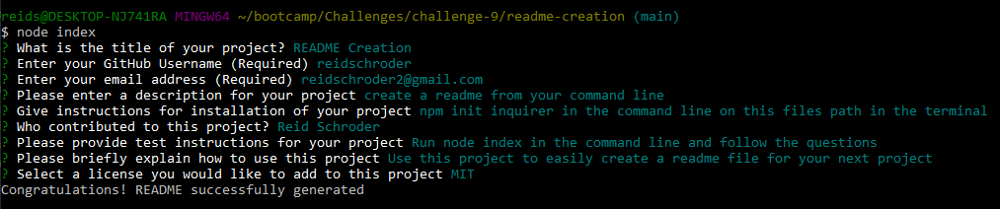

# README Creation

  

  ## Descripton
    create a readme from your command line

  ## Table of Contents
  [Installation](#installation)  
  [Usage](#usage)  
  [License](#license)  
  [Contributions](#contributors)  
  [Questions](#questions)  

  ## Installation
    npm init inquirer in the command line on this files path in the terminal

  ## Usage
    Use this project to easily create a readme file for your next project

  ## Contributions
    Reid Schroder

  ## Tests
  
  [Video Test](https://drive.google.com/file/d/1PpAJYOGy1SvULAccSk_AYoVWeQKtiVXl/view)
    Run node index in the command line and follow the questions 

    

  ## License
    This application was built with the MIT license. For more information, follow the link below.
    
    

  ## Questions
  If you have any questions, feel free to contact me using the links to my Github and email below.  
  [Github](github.com/reidschroder)  

  reidschroder2@gmail.com  

  [MIT](https://opensource.org/licenses/MIT)

